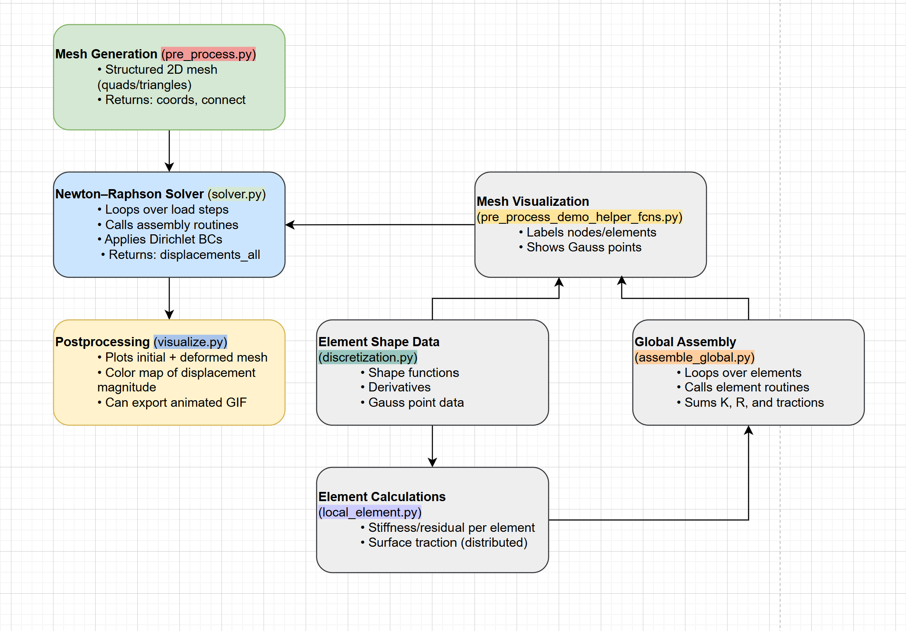

# Finite Element Hyperelastic Solver Framework

This repository implements a modular finite element solver for 2D/3D hyperelasticity problems. The code is designed around mesh generation, element formulation, global assembly, nonlinear solution using Newton-Raphson iterations, and post-processing of results.

The flowchart below illustrates the overall structure of the codebase and how different modules interact:



Each block in the flowchart corresponds to a file and its core responsibilities in the simulation pipeline.

---

## File Overview

### `pre_process.py` (Mesh Generation)

- Generates 2D meshes (structured grids) using triangular or quadrilateral elements
- Returns node coordinates (`coords`) and element connectivity (`connect`)

### `pre_process_demo_helper_fcns.py` (Mesh Visualization)

- Visualizes the mesh with labels
- Optionally shows Gauss points for debugging integration accuracy

### `discretization.py` (Element Shape Data)

- Supplies shape functions and derivatives for each element type
- Provides Gauss point locations and integration weights
- Includes mappings between global and local element faces

### `local_element.py` (Element Calculations)

- Computes element residual (internal force vector)
- Computes element surface tractions (distributed loads)
- Relies on `discretization.py` for shape functions

### `assemble_global.py` (Global Assembly)

- Loops through all elements
- Calls `local_element.py` routines to assemble the global stiffness matrix and residual vector
- Handles summation of contributions from all elements

### `solver.py` (Newton-Raphson Solver)

- Orchestrates the nonlinear solution loop
- Applies Dirichlet boundary conditions
- Performs load stepping and calls assembly routines

### `visualize.py` (Postprocessing)

- Displays both undeformed and deformed meshes
- Visualizes displacement magnitude
- Generates animations if desired

---

# Detailed Pipeline

## 1. Mesh Generation (`pre_process.py`)

Structured 2D meshes are created by dividing the domain into cells. Each cell is mapped to triangle or quadrilateral elements.

- For triangles (e.g., `D2_nn3_tri`), each cell is split into two triangles.
- For quads (e.g., `D2_nn4_quad`), each cell directly becomes an element.

The output is:

- `coords`: Node coordinates (shape `[n_nodes, 2]`)
- `connect`: Connectivity array mapping elements to nodes

---

## 2. Solver Framework (`solver.py` and dependencies)

### Governing Equations: What, Why, and How

**What:** We solve the balance of linear momentum for a hyperelastic material in static equilibrium:

$$
\nabla \cdot \mathbf{P} = \mathbf{0} \quad \text{in } \Omega
$$

where ${P}$ is the first Piola-Kirchhoff stress tensor, and $\Omega$ is the domain.

**Why:** For hyperelastic materials, the stress derives from a strain energy function. We seek displacement fields ${u}$ such that internal elastic forces balance applied loads.

**How (Weak Form):** Multiply by virtual displacements $\delta {u}$ and integrate by parts:

$$
\int_\Omega \delta \mathbf{F} : \mathbf{P} \; dV = \int_\Omega \delta \mathbf{u} \cdot \mathbf{b} \; dV + \int_{\partial \Omega_t} \delta \mathbf{u} \cdot \mathbf{t} \; dA
$$

This leads to the nonlinear residual:

$$
{R}({u}) = {f}_{ext} - {f}_{int}({u})
$$

### Newton-Raphson Method

To solve ${R}({u}) = 0$, use:

$$
\mathbf{K}(\mathbf{u}_k) \Delta \mathbf{u}_k = \mathbf{R}(\mathbf{u}_k)
$$

$$
\mathbf{u}_{k+1} = \mathbf{u}_k + \Delta \mathbf{u}_k
$$

where ${K} = \frac{\partial {R}}{\partial {u}}$ is the tangent stiffness matrix.

---

## 3. Internal Force and Stress Computation (`local_element.py`)

### Deformation Gradient:

$$
\mathbf{F} = \frac{\partial \mathbf{x}}{\partial \mathbf{X}} = \mathbf{I} + \nabla \mathbf{u}
$$

In code:

```python
F = I + grad_u
J = np.linalg.det(F)
```

### Strain Energy and Stress (Neo-Hookean):

Strain energy function:

$$
W(C) = \frac{\mu}{2}(I_1 - 3) - \mu \ln J + \frac{\lambda}{2} (\ln J)^2
$$

Kirchhoff stress:

$$
\boldsymbol{\tau} = \mu (\mathbf{B} - \mathbf{I}) + \lambda \ln J \cdot \mathbf{I}
$$

In code:

```python
tau = mu * (B - I) + lam * np.log(J) * I
```

### Residual Vector Assembly:

Loop over Gauss points:

```python
rel += B.T @ tau.flatten() * detJ * weight
```

---

## 4. Global Assembly (`assemble_global.py`)

Loops over elements and calls local functions:

```python
for e in range(n_elements):
    rel_e = local_element.element_residual(...)
    R_global[connect[e]] += rel_e
```

Each element’s stiffness and residual are inserted into the global system.

---

## 5. Postprocessing (`visualize.py`)

Final displacement field ${u}$ is reshaped and added to node positions:

$$
\mathbf{x}_{\text{deformed}} = \mathbf{x} + \alpha \mathbf{u}
$$

Displacement magnitude (color map):

$$
||\mathbf{u}|| = \sqrt{u_x^2 + u_y^2}
$$

---
